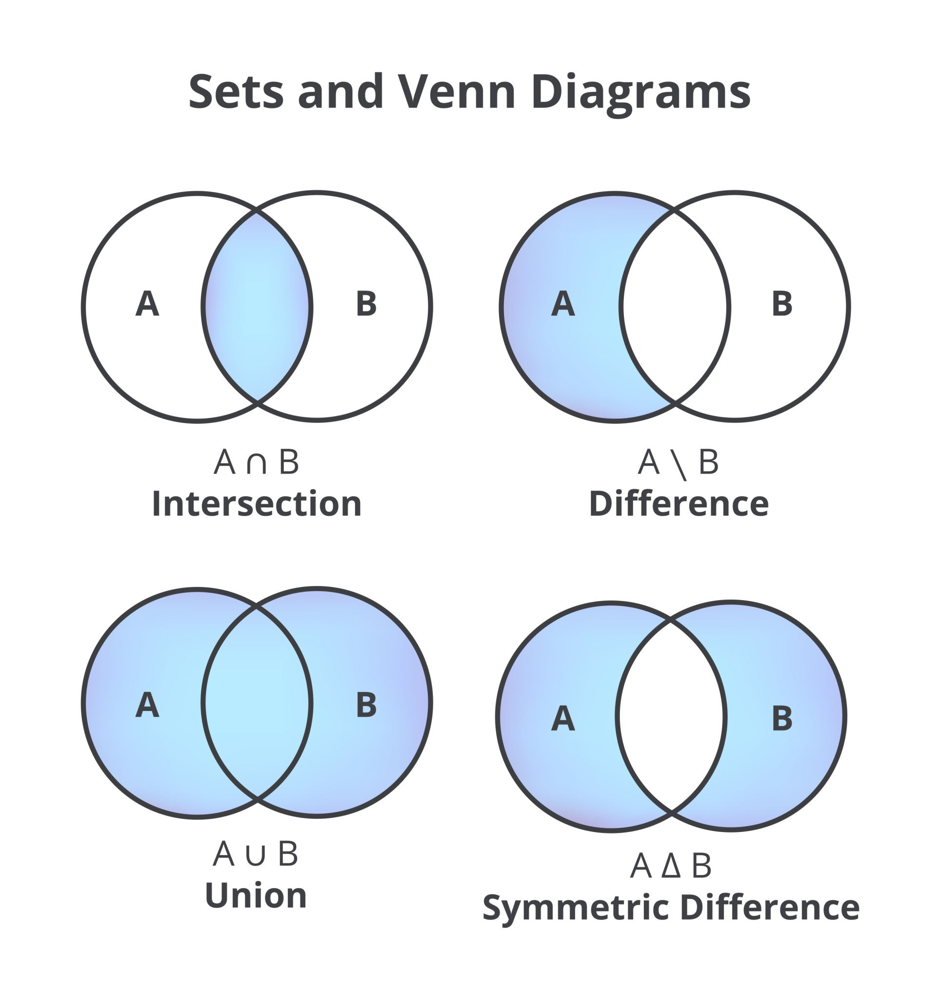

# 📂 Seção 11 : Sets - Conjuntos e Operações Matemáticas

## 📑 Sets

> **Status:** 🟡 CONCLUIDO | **Data:** 14/04/2026

### 🌐 Navegação rápida

| **🏠 HOME**          | [Retornar ao Início](../../0-organization/python-artigas-home.md) |
| :------------------- | :---------------------------------------------------------------- |
| &#8657; **Anterior** | [ANTERIOR](./colecoes-tuplas.md))                                 |
| &#8659; **Próximo**  | [PROXIMO](./colecoes-dicts.md)                                    |

---

### 📺 Conteúdo em Vídeo (Udemy)

- [✅] **[Vídeo 01](https://www.udemy.com/course/python-completo-e-profissional/learn/lecture/28622032#overview):** Sets em Python — _(10min)_
- [✅] **[Vídeo 02](https://www.udemy.com/course/python-completo-e-profissional/learn/lecture/28622060#overview):** Acessando Itens — _(5min)_
- [✅] **[Vídeo 03](https://www.udemy.com/course/python-completo-e-profissional/learn/lecture/28692988#overview):** Adicionando Itens — _(6min)_
- [✅] **[Vídeo 04](https://www.udemy.com/course/python-completo-e-profissional/learn/lecture/28693008#overview):** Removendo Itens — _(10min)_
- [✅] **[Vídeo 05](https://www.udemy.com/course/python-completo-e-profissional/learn/lecture/28693010#overview):** Loop em Set — _(5min)_
- [✅] **[Vídeo 06](https://www.udemy.com/course/python-completo-e-profissional/learn/lecture/28693016#overview):** Juntando Sets — _(15min)_
- [✅] **[Vídeo 07](https://www.udemy.com/course/python-completo-e-profissional/learn/quiz/5346086#overview):** Teste — _(00min)_

> **Nota rápida:** [permeando as variações de coleção de dados para os Sets]

---

### 📝 Anotações e Conceitos Chave

#### 1. Sets

- NAO ORDENADA E NAO INDEXADA.
  - Informa que a ordem varia
  - Informa que duplicação é excluida
- escrito entre chaves {}.
- set_unico = {"item",}

- Exemplo de sintaxe ou regra:

```python
    #exemplos

    desejos = {"ficar rico", "felicidade", "ficar rico", "saúde", "ficar rico"}
    print(desejos)
        #return "felicidade", "ficar rico", "saúde" (ignora repetição)
    print(len(desejos)) #return 3 como na impressão (ignora repetição)

    sobra_pro_betinha = set(("Nada", "Brutal", "Nada", "It's Over"))
        #força a tupla = (" ",) a virar um set = {" ",}
    print(sobra_pro_betinha) # return Brutal, Nada, It's Over

    erro_index = desejos[0] #return ErrorValue

    sets_dados_variados = {7, "sete", True}
        #⚠️ curiosidade
        # 1 é equivalente a True
        # 0 equivalente a False
        # entao um set = {1, True} considera como apenas 1 valor
    type(sets_dados_variados) #return <class = "set">
```

#### 2. Acessando Itens | Adicionando Itens

- Usando loop for
  - e pergunta se in value
  - ou obter o valor desordenado
- informa que os valores NAO PODEM SER ALTERADOS
- Informa sobre o metodo add()
- informa sobre o metodo update()

- EXPLICAÇÃO.
- Exemplo de sintaxe ou regra:

```python
    ingredientes = {"huum queijinho", "sarxixa", "mortandela"}

    #acessando com loop For
    for gostosura in ingredientes:
        print(f"Agora vou adicionar no pão: {gostosura}")
        #retorna desordenadamente todos os valores do set
        #informa que por index: gostosura[0] retorna erro


        if "algo normal" in gostosura:
            print("quem disse que eu quero algo normal?")
            #saber se há algo dentro do Set com In


    #uni_duni_te = [escolha for escolha in ingredientes]
        #list compreehension criará uma versao do Set como List


    #metodo add > usado para um item
    ingredientes.add("manteiguinha")
        #⚠️ não tem return para os metodos add e update
        #eles apenas alteram os sets
        sanduba_com_manteiga = ingredientes.add("manteiguinha")
        print(sanduba_com_manteiga) #return None

    #metodo update > usado para vários
    opt_saud = {"UM ALFACE",}
    ingredientes.update(opt_saud)

        #update aceita listas e qualquer iterável
        porcarias = ["Danone", "Leite condensado", "Danone"]

        soletrando = "ABC" #update adionaria "A", "B", "C"
        bloco_letras = ["ABC"] #update add "ABC"

        ingredientes.update(porcarias)
            #metodo update tambem rejeita duplicatas

```

#### 3. Remover Itens

- Informa sobre os metodos remove().
- INforma sobre o metodo discard().
- informa sobre o metodo pop()
- informa sobre o metodo clear e del
-
- Exemplo de sintaxe ou regra:

```python
    #exemplo
    impostor = {"Potter", "Black", "Lupin", "Pettigrew"}

    #remover com remove()
    impostor.remove("Pettigrew") #sucesso
    impostor.remove("Peter") #return Keyerror por não encontrar

    #remover com discard()
    impostor.discard("Pettigrew") #sucesso
    impostor.discard("Peter") #return None mas não da erro

    #remover com pop()
    palpite = impostor.pop()  #remove o ultimo aleatoriamente
        print(palpite)
```

#### 4. Loop em Set

- Reforça como iterar em um loop set
- EXPLICAÇÃO.
- Exemplo de sintaxe ou regra:

```python
  # titulo do código

    pega_pega = {"Pivete_1", "Pivete_2", "Pivete_3"}

    for pego in pega_pega:
        print(f"{} foi pego!")

```

#### 5. Juntando Sets

- Informa que usar o update()
- informa o metodo union(set)

- informa o metodo intersection_update(set)

- informa o metodo symmetric_difference_update()
- informa o emtodo symmetric_difference()

- Lógica de Conjuntos (Venn)

- Exemplo de sintaxe ou regra:

```python
    #Exemplos
    print("Qual a parte branca do ovo?")
    gema = {" "}
    clara = {"AIN "}

    #juntando com update() junta todos (excet repeat)
    gema.update(clara) #altera gema para unido

    #juntando com union() > junta todos (excet repeat)
    piada = gema.union(clara)

    #juntar só os valores ja existentes
    xadrez = {"branco", "preto", "branco"}
    peca_branca = {"branco"}
    peca_preta = {"preto"}

    xadrez.intersection_update(peca_branca) #só em ambos
        #xadrez só terá branco
    xadrez.intersection_update(peca_preta)
        #xadrez só terá preta
    retorno = set1.update(set2) #retorna None

    #juntar por valores nao existentes (contrario)
    xadrez.symmetric_difference_update(peca_branca)  #tira dos dois
        #xadrez só mantem o preto

    #
    marmore = xadrez.symmetric_difference(peca_branca) #mantem dos dois
        #marmore recebe só branco e nao modifica xadrez

    #⚠️ Nota: As linhas acima não funcionam em sequencia como mostrado, somente se diretamente após a definição do set orignial (sem as manipulações anteriores)
```



#### 6. Teste

- Os itens de uma coleção de tipo Set não são ordenados, não podem ser alterados e não permitem valores duplicados. | True.
- Depois que um a coleção de tipo Set é criada, você NÂO pode alterar seus itens, e NÂO pode adicionar novos itens.| False.
- Exemplo de sintaxe ou regra:

```python
  # titulo do código

```

### x. 🛠️ Revisões

::to-review:: 16-04-2026 ::Coleção Sets::

💻 Notas / Código

```python
# Seu código aqui
```
