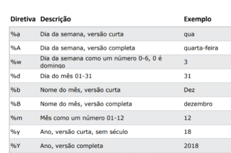

# 📂 Seção 23 : Manipulação de Datas e Fusos Horários

## 📑 Data Treatment

> **Status:** 🟡 ANDAMENTO | **Data:** 07/05/2026

### 📺 Conteúdo em Vídeo (Udemy)

- [✅] **[Vídeo 103](https://www.udemy.com/course/python-completo-e-profissional/learn/lecture/28884418#overview):** Datas! — _(Duração)_
- [ ] **[Vídeo 104](https://www.udemy.com/course/python-completo-e-profissional/learn/lecture/28884426#overview):** Objetos de Data — _(Duração)_
- [ ] **[Vídeo 105](https://www.udemy.com/course/python-completo-e-profissional/learn/lecture/28959506#overview):** Strtime() — _(Duração)_

> **Nota rápida:** [muito util vou usar]

---

### 📝 Anotações e Conceitos Chave

#### 1. bibliotea datetime

- informa sobre o metodo datetime.datetime.now()
  - Metodo Now()
- Exemplo de sintaxe ou regra:

```python
    #exemplos
    import datetime

    data_atual = datetime.datetime.now()
    print(data_atual) #retorna 2026-05-06 10:00:00 1234567
    #formato padrao AAAA-MM-DD SEG MICROSEG

    ano_atual = data_atual.year()
    mes_atual = data_atual.month()
    dia_atual = data_atual.day()
    segundo_atual = data_atual.second()

    dia_da_semana = data_atual.strftime("%A")
```

#### 2. Objetos de Data

- informa sobre o modulo e classe homonimos, e metodo now()
  - datetime.datetime.now()
- podemos construir uma data atraves da classe.

- Exemplo de sintaxe ou regra:

```python
    #construindo datas com a classe date time
    import datetime

    literal_data = datetime.datetime(2026, 05, 06, 10, 20, 59)
    #ano, mes, dia, hora, minuto, segundo

    subtrair_datas = literal_data - data_atual
        #retorna a diferença

    #impossivel fazer adição de datas
```

#### 3. Metodo strftime

- informa que serve para retornar a data em um formato específico.
- EXPLICAÇÃO.
- Exemplo de sintaxe ou regra:

```python
    #exemplo

    import datetime

    data_atual = datetime.datetime.now()

    diretiva_Nomecompleto_mes = data_atual.strftime("%B") #retorna May

    diretiva_Nomecompleto_semanacompleta = data_atual.strftime("%A") #retorna thusday
    diretiva_Nomecompleto_semanacurta = data_atual.strftime("%A") #retorna thu

    diretivas_combinadas = data_atual.strftime("%A, %d %B %Y")
    #retorna:
    #dia da semana
    #virgula
    #numro do dia
    #mes completo
    #ano 4 digitos

```



### x. 🛠️ Revisões

::to-review:: 08-05-2026 ::Datetime::
