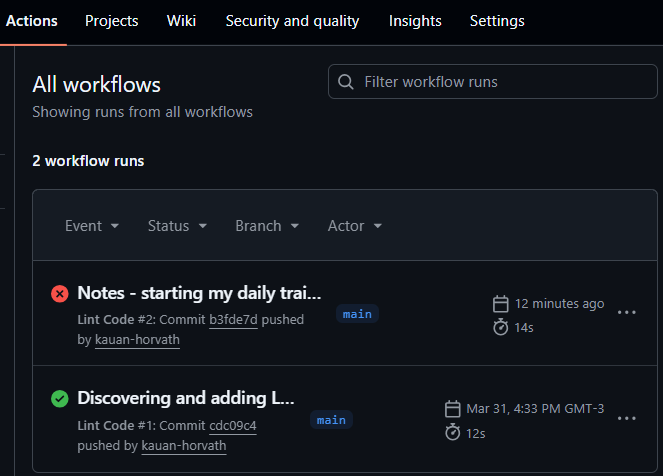

# 🛡️ Lint Showcase: Quality Assurance Automation (CI)

I implemented a **Continuous Integration (CI)** workflow using **GitHub Actions** to ensure the integrity of the Python code.

- **How it works:** Every time new code is **pushed**, an automated runner (Ubuntu environment) is triggered to check for syntax errors and coding patterns.
- **Tool:** `Flake8` (Linter).
- **Objective:** To keep the repository free of basic errors and ensure the project follows modern development best practices without manual effort.

Example: 

---

**Quick Tip:** If you want to make your `README.md` look like a truly professional project, you can add this "badge" to the top of your file. It automatically updates to **"passing"** (green) whenever the test succeeds:

```markdown

```
